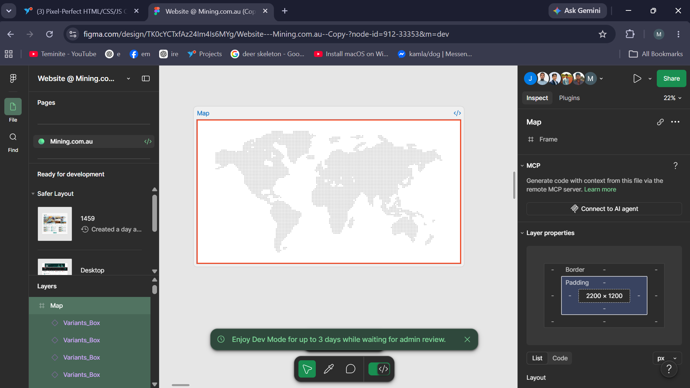
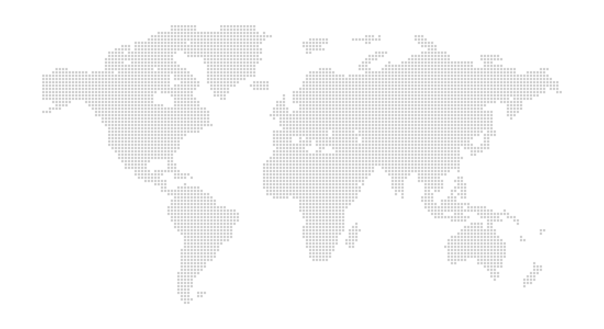

# dev-contest

**Pixel-Perfect Frontend Build using Plain HTML, CSS & JS, built from included Figma design for Freelancer.com contest.**

---

## Live Demo

**[creative-bublanina-12c59e.netlify.app](https://creative-bublanina-12c59e.netlify.app/)**

Source code: [`index.html`](./index.html) · [`style.css`](./style.css) · [`script.js`](./script.js)

---

## The Challenge

I decided to turn this frame from the provided Figma designs into a pixel-perfect frontend for the contest:



---

## Why This Frame?



Well, the world map frame is a map build with **5200+ small gray squares** placed precisely to build the map. So, I thought this would be a proper challenge and I could showcase how pixel perfect I can build the frontend, by reconstructing the entire map using precisely placed squares of the same size using plain HTML and CSS.

On top of the static layout, I added a bit of vanilla JS so users can:

- **Pan** around the map
- **Zoom in / zoom out**

---

## My Workflow

The whole build took me about 40 minutes. In my usual workflow, I like to use automation scripts I write in Python to analyze, summarize or extract information from design images, to automate the frontend development process and do things more precisely and perfectly. I also use AI tools for assistance as well, but only for potential enhancements or optimization ideas. By using automation scripts, I was able to build this frontend within just 40 minutes. In the past, I've written automation scripts for assistance in the process of building websites for multiple frontend development projects, whether for simple minimalistic websites, or for more complex interactive widgets or animations.

### The automation script

[`build_world_map_from_png.py`](./build_world_map_from_png.py) is included in this repo for reference only. It:

1. Analyzes the source design image to extract the **precise coordinates and count** of every square in the map
2. Stores that data in [`occupied_cells.json`](./occupied_cells.json)
3. Uses that data to generate the map as a grid, wired into the `HTML`, `CSS`, and `JS` files

---

## 📁 Project Structure

```
dev-contest/
├── index.html                   # Markup
├── style.css                    # Styling / grid layout
├── script.js                    # Pan & zoom interactivity
├── build_world_map_from_png.py  # Automation script (design → grid data)
├── occupied_cells.json          # Extracted square coordinates
├── frame.png                    # Figma design reference
└── map.png                      # World map design reference
```

---

# Tech Stack
As wanted:
- **HTML5**
- **CSS3**
- **Vanilla JavaScript**

For my own automation to assist during development:
- **Python** (for the design-to-grid automation script)

---

## Final thoughts and Questions

I am okay with the 40 hours/week workload, and I would prefer the 9am-5pm IST timing if I am selected for this job. 
Also, I see that the prize for this contest is set to be $506 AUD, but the hourly wage for the job is $11/hour. 
If I were to win the contest, would I get the $506 AUD prize after winning and then join the $11/hour full time job, or is it just a placeholder, and I would only get paid after the job starts?

---

## Note

Thank you for taking the time to review this submission!
